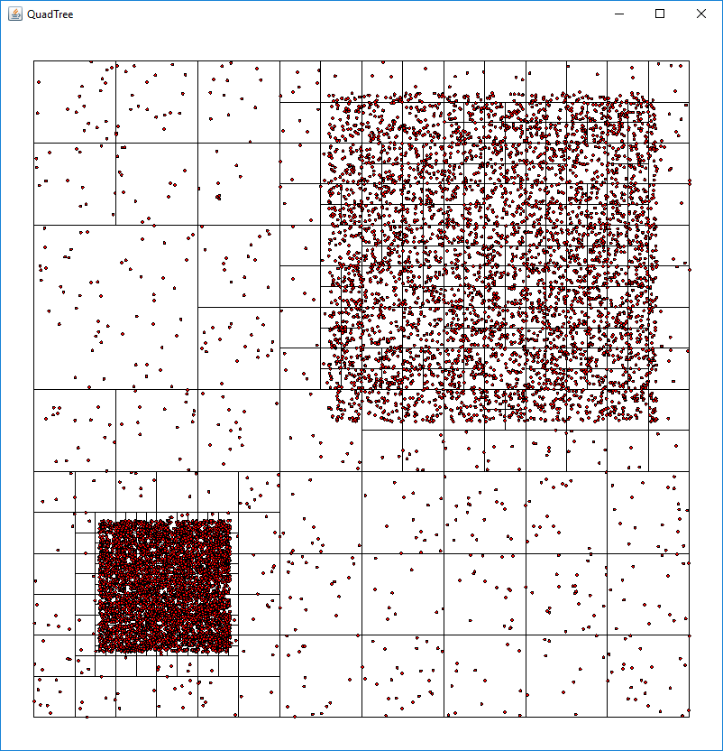

# Incremental Spatial Search

<p>
  
</p>

Scala implementation of the incremental spatial search implementation described
e.g. in Samet: Foundations of Multidimensional and Metric Data Structures.
* The purpose is to offer very general framework
to build on: the incremental spatial search allows very flexible queries where
e.g. the search state is manipulated on the fly (e.g. filter elements and prune nodes in the queues)
* Currently only quadtree is implemented as a concrete and well-optimized class (QuadTree)
* R-tree implemented as a proof-of-concept (RTree)
* Work in progress


## Usage
### Insertion
#### If the points are known
``` scala
class MyData()
val points = Seq.fill(100)(Float2.random)
// wrap your data with coordinates
val dataPoints = points.map{p => DataPoint(p, new MyData())}
val quadTree = QuadTree[DataPoint[MyData]](dataPoints)
```
#### If the area is known
``` scala
val quadTree = QuadTree[Float2](AABB.unit)
points.foreach(quadTree.add)
```

#### If the area must expand based on incoming data
``` scala
val quadTree = QuadTree(points)
val outsidePoints = Seq.fill(100)(Float2(1, 1) + Float2.random)
outsidePoints.foreach(quadTree.addEnclose)

```

### Queries
``` scala
val queryPoint = Float2(0.5, 0.5)
val knn = quadTree.knnSearch(queryPoint, 10)
val range = quadTree.rangeSearch(queryPoint, 0.2)
val poly = quadTree.polygonalSearch(queryPoint)

```

### Point removal
``` scala
val toBeRemoved = points.take(20)

// Using coordinates to traverse straight to the leaf
points.foreach(p => quadTree.remove(p))

```

For more detailed examples, see test cases.

## Performance
Naive performance tests run against a 
[Java kd-tree implementation](http://robowiki.net/wiki/User:Chase-san/Kd-Tree) with 10k inserted points
show that the QuadTree performance is about 20-35% better in insertions, and knn and range searches.

```
== Test info == 
Point count: 10000
Run count: 200
Query count (per run): 1000
Insert run count: 2000
Knn k: 100
Range: 250.0 out of total point area of 1000.0 x 1000.0
Quadtree. depth: 7 nodeCount: 633
================

== Insert time == 
KDTree: 1.697278063E-4 (ms/insert)
QuadTree: 1.2778786165E-4 (ms/insert)
Ratio (Quad/KD): 0.7528987997649033

== Knn query time == 
KDTree: 0.023937707545 (ms/query)
QuadTree: 0.01544552218 (ms/query)
Ratio (Quad/KD): 0.645238152022882

== Range query time ==
KDTree: 0.044225099440000006 (ms/query)
QuadTree: 0.028976486620000002 (ms/query)
Ratio (Quad/KD): 0.6552045554880498
...
```

## TODO:
* Improve this document (usage, visualization etc.)
* Searches with query point of type Seq[Float2]
* Optimize r-tree (performance is not very good ATM)
